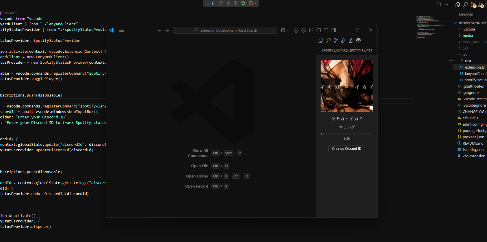

# Spotify Player for VS Code using Lanyard API

VS Code Extension to Display Your Spotify Song Using the Lanyard API



### How to Use
- Join the Lanyard Discord server: [Lanyard Discord](https://discord.com/invite/UrXF2cfJ7F)
- Enter your Discord ID when starting the extension.
- **Note:** The extension will only monitor Spotify if you are in the Lanyard server.

### How to Compile
```sh
npm install --save-dev @types/semver --legacy-peer-deps
npm run compile
```

### Debug
Press `F5` to debug the extension.

### Known Issues
- Success and error messages do not disappear after a certain time.

### Credits
- [Phineas - Lanyard](https://github.com/Phineas/lanyard) for the API
- [mgehrt1 - Spotify Player](https://github.com/mgehrt1/spotify-player) for inspiration
